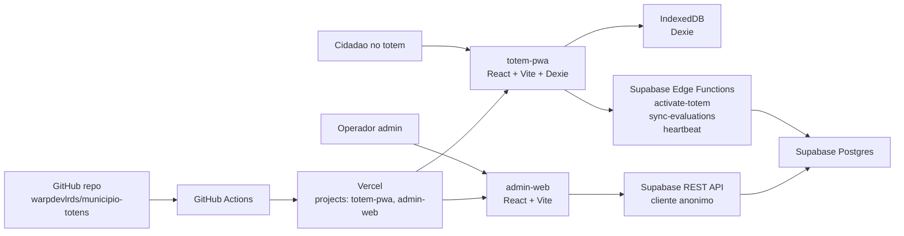

# Arquitetura

Documento alinhado ao estado verificado em `2026-03-26`.
Ele descreve a arquitetura que existe hoje e aponta, sem mascarar, os principais desvios entre o desenho atual e o que seria aceitavel para producao.

## Visao Geral

O sistema possui duas interfaces principais:
- `totem-pwa`: kiosk PWA executado no dispositivo de atendimento
- `admin-web`: painel administrativo em navegador

O backend esta centralizado no Supabase:
- PostgreSQL com schema versionado por migrations
- Edge Functions em Deno
- Supabase Auth usado apenas parcialmente no admin, sem RBAC robusto

Os frontends sao servidos pela Vercel e o repositorio principal esta no GitHub.

## Diagrama de Alto Nivel

## Monorepo

| Caminho | Papel |
| --- | --- |
| `apps/totem-pwa` | PWA do kiosk, com ativacao, exibicao de questionarios e coleta offline |
| `apps/admin-web` | Painel de gestao de unidades, totens, questionarios e relatorios |
| `packages/types` | Tipos compartilhados |
| `packages/utils` | Helpers genericos |
| `packages/supabase-client` | Cliente Supabase e wrappers de Edge Functions |
| `packages/offline-sync` | Banco local Dexie e fila de sincronizacao |
| `packages/ui` | Espaco reservado para componentes compartilhados |
| `supabase/migrations` | Schema e evolucao do banco |
| `supabase/functions` | Funcoes backend do Supabase |

## Fluxos Criticos

### 1. Ativacao do Totem
1. O usuario informa `codigo_totem` e `chave_ativacao`.
2. `totem-pwa` chama `activate-totem`.
3. A function valida a chave, marca a ativacao como usada, atualiza o totem para `online` e devolve questionarios ativos.
4. O frontend persiste `totem_id` e metadados no IndexedDB.

Observacao importante:
- A function ja devolve `questoes`, mas o hook atual do totem descarta esse payload no cache local e grava `questoes: []`.

### 2. Coleta de Avaliacoes
1. O totem busca questionarios do estado em memoria e do storage local.
2. Cada avaliacao gera um `client_id`, `session_id` e payload de respostas.
3. Os dados ficam primeiro no IndexedDB via `packages/offline-sync`.

### 3. Sincronizacao
1. O `SyncManager` move avaliacoes pendentes para uma fila Dexie.
2. Quando online, chama `sync-evaluations`.
3. A Edge Function grava `avaliacoes`, `respostas` e `sync_log`.
4. O queue item e marcado como sincronizado quando o `client_id` volta em `synced_ids`.

Observacao importante:
- A function aceita qualquer `totem_id` informado pelo cliente e usa service role para gravacao.

### 4. Heartbeat
1. O totem chama `heartbeat` periodicamente.
2. A function atualiza `totens.ultimo_ping`, mantem `totem_sessoes` e retorna as versoes de questionario.

Observacao importante:
- O frontend hoje nao fecha o ciclo de refresh com base nessa resposta.

### 5. Operacao Administrativa
1. O admin se autentica no Supabase Auth.
2. O painel usa o cliente Supabase no browser para CRUD direto nas tabelas.
3. A seguranca depende de policies abertas, nao de backend protegido.

## Decisoes Arquiteturais Atuais

### Acertos
- Monorepo simples e legivel
- Separacao razoavel entre apps e packages
- Backend funcionalmente pequeno e objetivo
- Persistencia offline centralizada em um package reutilizavel

### Limites
- O admin nao possui backend proprio; fala com o banco direto
- Nao existe modelo de papeis formal para administradores
- Nao existe identidade robusta de dispositivo para totem
- A estrategia PWA existe, mas nao fecha todo o ciclo offline-first

## Dividas Arquiteturais Prioritarias

### Seguranca de dados
- Policies RLS usam `true` em pontos que deveriam ser restritos por papel ou por identidade de dispositivo.
- A combinacao `cliente anonimo + CRUD direto + policies permissivas` elimina a separacao entre frontend e backend.

### Confiabilidade offline
- O cache inicial do totem nao persiste as questoes recebidas.
- O service worker usa cache generico e nao expõe um fluxo robusto de invalidacao/versionamento.

### Operacao em escala
- Relatorios sao agregados no browser com consultas amplas.
- Falta observabilidade de sync queue, totems offline, erros de Edge Functions e drift entre deploy e `main`.

## Arquitetura Alvo Recomendada

1. Mover mutacoes administrativas para Edge Functions ou backend server-side autenticado.
2. Introduzir RBAC real para administradores e credencial de dispositivo para totens.
3. Tratar `totem-pwa` como app publica de kiosk, separando claramente preview protegido de runtime publico.
4. Implementar refresh incremental de questionarios e estrategia de cache versionado.
5. Empurrar agregacoes pesadas para banco ou backend, nao para o navegador.

## Principio de Leitura

Esta arquitetura nao deve ser lida como "design ideal".
Ela documenta a realidade atual para que qualquer correcao futura parta de fatos verificados, nao de suposicoes.
