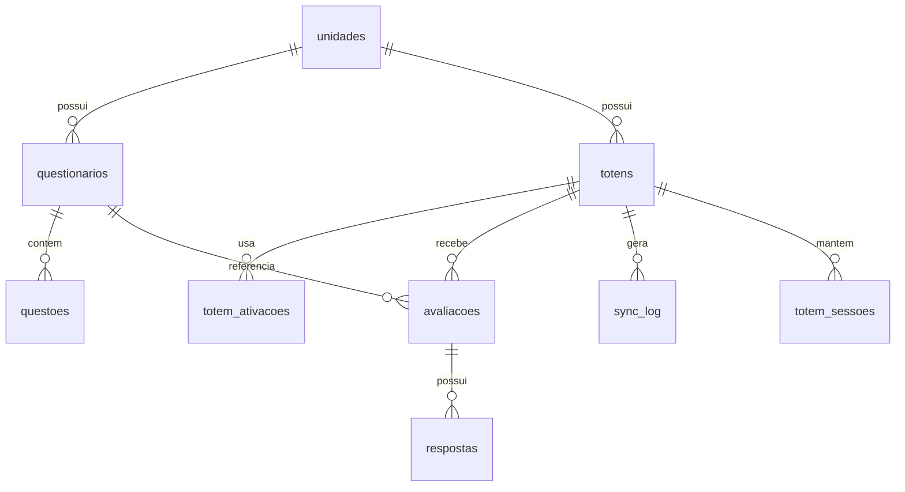

# Database

Schema documentado a partir das migrations versionadas e do estado remoto alinhado em `2026-03-26`.

## Projeto Supabase
- Project ref: `nyjsclgdhxsqvncnrlxe`
- Banco: PostgreSQL gerenciado pelo Supabase
- Extensao usada: `pgcrypto`

## Inventario de Migrations

| Migration | Objetivo |
| --- | --- |
| `20240324000001_initial_schema.sql` | schema base, enums, tabelas, indices e policies iniciais |
| `20260324050000_add_client_id_to_avaliacoes.sql` | adiciona `avaliacoes.client_id` e indice unico parcial |
| `20260324064213_remote_schema.sql` | marcador neutro de alinhamento remoto |
| `20260324081000_expand_respostas_valor_nota.sql` | amplia `valor_nota` para `NUMERIC(4,2)` |
| `20260324132000_admin_frontend_alignment.sql` | adiciona `totens.last_heartbeat`, `configuracoes` e seeds correspondentes |
| `20260326042103_p0_security_hardening.sql` | adiciona `admin_users`, `is_admin_user()`, token de dispositivo e substitui policies permissivas |

## Modelo de Dados

## Tabelas

| Tabela | Papel | Campos relevantes | Observacoes |
| --- | --- | --- | --- |
| `unidades` | orgaos/locais atendidos | `nome`, `cnpj`, `municipio`, `estado`, `ativo` | base para associacao de totens e questionarios |
| `questionarios` | formulario por unidade ou global | `unidade_id`, `nome`, `ativo`, `versao`, `data_inicio`, `data_fim` | filtrado por unidade e janela de disponibilidade |
| `questoes` | itens do questionario | `questionario_id`, `texto`, `tipo`, `obrigatoria`, `ordem`, `opcoes` | `opcoes` fica em JSONB |
| `totens` | dispositivos fisicos/logicos | `unidade_id`, `codigo`, `status`, `versao_app`, `ultimo_ping`, `device_token_hash` | possui `last_heartbeat` gerado a partir de `ultimo_ping` |
| `totem_ativacoes` | chave unica de ativacao | `totem_id`, `chave_ativacao`, `ativado_em`, `expira_em`, `ativo` | hoje a chave e exibida no admin |
| `avaliacoes` | submissao principal do totem | `totem_id`, `questionario_id`, `session_id`, `client_id`, `status`, `ip_address`, `synced_at` | `client_id` evita duplicidade no sync |
| `respostas` | respostas individuais | `avaliacao_id`, `questao_id`, `valor_texto`, `valor_nota` | `valor_nota` esta em `NUMERIC(4,2)` |
| `sync_log` | trilha basica de sincronizacao | `totem_id`, `tipo`, `registros`, `sucesso`, `erro_mensagem` | hoje e tecnico, nao substitui auditoria real |
| `totem_sessoes` | heartbeat/sessao ativa | `totem_id`, `ultimo_ping`, `ip_address` | atualizada pela function `heartbeat` |
| `configuracoes` | configuracoes globais do admin | `chave`, `valor`, `descricao` | criada para atender o frontend admin atual |
| `admin_users` | lista de usuarios administrativos autorizados | `user_id`, `email`, `display_name`, `ativo` | usada por `is_admin_user()` para RLS |

## Enums

| Enum | Valores |
| --- | --- |
| `totem_status` | `offline`, `online`, `manutencao`, `inativo` |
| `avaliacao_status` | `pendente`, `processada`, `erro` |
| `questao_tipo` | `nota`, `escolha_unica`, `escolha_multipla`, `texto_livre` |

## Indices Importantes
- `idx_totens_codigo`
- `idx_totens_status`
- `idx_questoes_questionario`
- `idx_avaliacoes_totem`
- `idx_avaliacoes_created`
- `idx_avaliacoes_client_id_unique` (parcial)
- `idx_respostas_avaliacao`
- `idx_totem_ativacoes_chave`
- `idx_totem_sessoes_totem`

## Seeds

O repositorio possui `supabase/seed.sql` com:
- 2 unidades de exemplo
- 2 questionarios
- 6 questoes
- 3 totens
- 3 chaves de ativacao
- configuracoes basicas
- avaliacoes e respostas de exemplo

Use os seeds apenas como dados de desenvolvimento ou homologacao controlada.

## RLS - Estado Atual

O banco tem RLS habilitado com endurecimento P0 aplicado.
As policies abertas iniciais foram removidas e as tabelas administrativas agora usam `public.is_admin_user()` como gate de acesso.

| Objeto | Estado atual | Risco |
| --- | --- | --- |
| `unidades` | `FOR ALL` com `is_admin_user()` | leitura anonima retorna vazio; mutacao anonima bloqueada |
| `questionarios` | `FOR ALL` com `is_admin_user()` | requer membership em `admin_users` |
| `questoes` | `FOR ALL` com `is_admin_user()` | requer membership em `admin_users` |
| `totens` | `FOR ALL` com `is_admin_user()` | mutacoes sensiveis saem do alcance anonimo |
| `totem_ativacoes` | `FOR ALL` com `is_admin_user()` | geracao/leitura de chaves restrita |
| `avaliacoes` | `FOR ALL` com `is_admin_user()` | insercoes diretas anonimas bloqueadas; ingestao via functions com service role |
| `respostas` | `FOR ALL` com `is_admin_user()` | insercoes diretas anonimas bloqueadas |
| `sync_log` | `FOR ALL` com `is_admin_user()` | escrita direta anonima bloqueada |
| `totem_sessoes` | `FOR ALL` com `is_admin_user()` | escrita anonima bloqueada; atualizacao via function autenticada por token de dispositivo |
| `configuracoes` | `FOR ALL` com `is_admin_user()` | configuracao restrita a admin autorizado |
| `admin_users` | `SELECT` self-only | cada usuario enxerga apenas o proprio registro |

## O Que Falta no Modelo de Dados
- trilha de auditoria de operacoes sensiveis
- trilha de revogacao/rotacao de chaves
- agregacoes materializadas para relatorios

## Recomendacao Estrutural

1. Criar RBAC formal para administradores.
2. Separar acesso de leitura publica do totem de mutacoes administrativas.
3. Remover policies `true` e migrar operacoes sensiveis para backend autenticado.
4. Adicionar entidades para auditoria, identidade de dispositivo e operacao.

Sem essas mudancas, o schema continua funcional, mas nao atende o nivel de seguranca esperado para producao.
